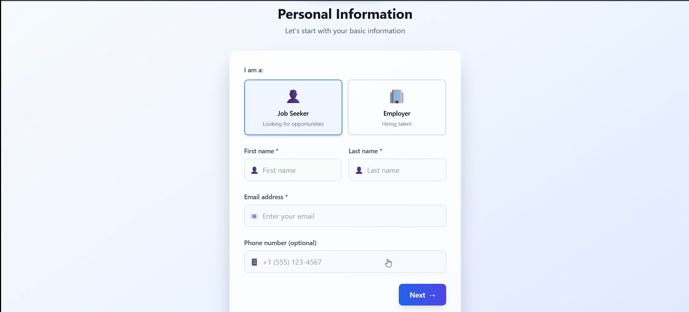
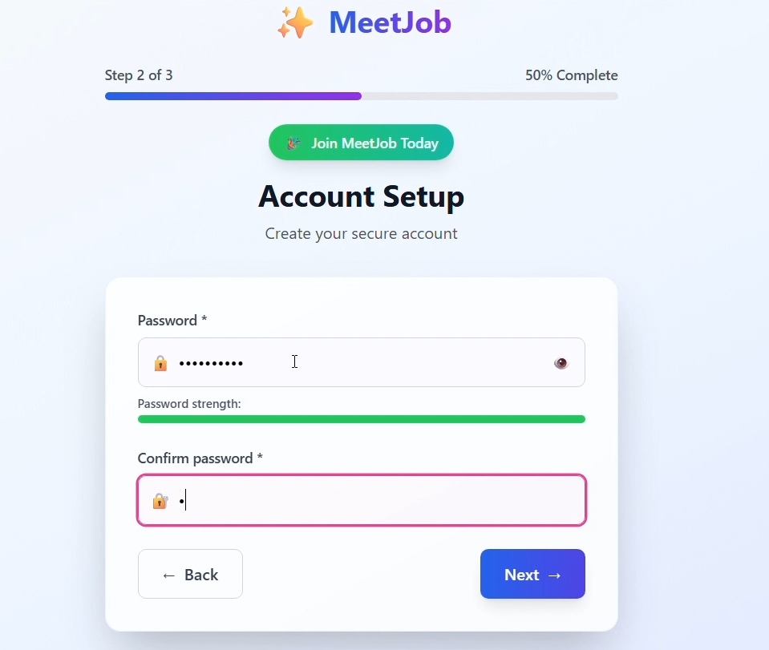
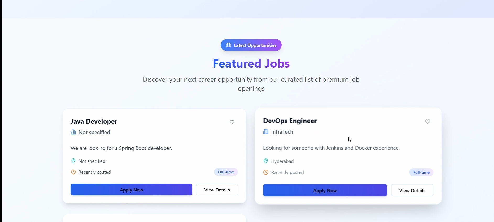

# 🧑‍💼 MeetJob - Job Portal Web Application

A full-stack Job Portal built using **Spring Boot**, **React.js**, and hardcoded jobs with **JWT Authentication**.

---

## 🚀 Features

- 🔐 User Authentication (JWT-based Sign In / Sign Up)
- 📝 Post and Search Jobs by Title and Location
- 📄 View Job Details and Apply
- 🧠 User role management (USER / ADMIN ready)
- 🌐 Responsive UI with Tailwind CSS and ShadCN
- 🔄 Secure Login + Logout with Token Management
- ✅ CORS and Axios configured for cross-origin requests

---

## 🧱 Tech Stack

| Frontend     | Backend        | Database    | Auth      | Hosting Ready |
|--------------|----------------|-------------|-----------|----------------|
| React.js     | Spring Boot    | Hardcoded   | JWT Token | Render, Vercel, Netlify |

---

## 📁 Project Structure

```
jobportal-backend/
 └── com.example.jobportal
      ├── model/
      ├── controller/
      ├── repository/
      ├── config/ (Security, JWT)
      ├── service/
      └── util/
jobportal-frontend/
 └── src/
      ├── components/
      ├── pages/
      ├── hooks/
      └── services/
```

---

## ⚙️ Setup Instructions

### ✅ Backend (Spring Boot)

1. No database configuration needed as jobs are hardcoded.

2. Run:
```bash
./mvnw spring-boot:run
```

---

### ✅ Frontend (React.js)

1. Navigate to `jobportal-frontend`
2. Install dependencies:
```bash
npm install
```

3. Start frontend:
```bash
npm start
```

---

## 🔐 Authentication

- Login & Registration with JWT
- Token is stored in `localStorage`
- Authenticated requests include `Authorization: Bearer <token>`

---

## 💡 Future Improvements

- Role-based job posting (Admin only)
- Job Application tracking system
- File upload (Resume/CV)
- Pagination + Search Filters

---

## 📸 Screenshots








---

## 🧑‍💻 Author

Made with ❤️ by [Rohit Rawat]

---
